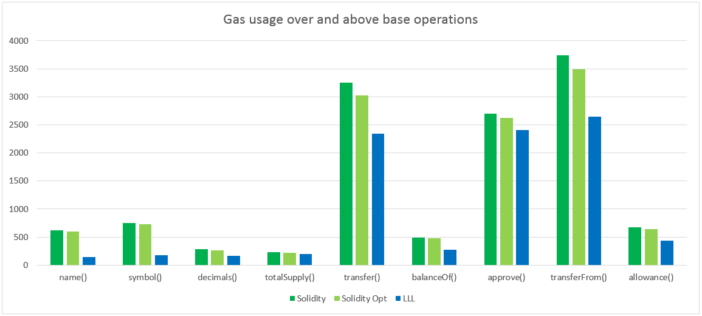
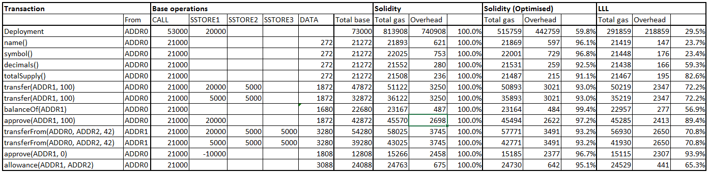

# LLL

 * [Introduction](#introduction)
 * [ERC20 LLL contract](#erc20lll-an-implementation-of-ethereum-erc20-tokens-in-lll)
 * [Benchmarking](#benchmarking-the-erc20-contract-against-solidity)


## Introduction

According to the Ethereum [Homestead
Documentation](http://www.ethdocs.org/en/latest/contracts-and-transactions/contracts.html#id4),

> Lisp Like Language (LLL) is a low level language similar to Assembly. It is
  meant to be very simple and minimalistic; essentially just a tiny wrapper
  over coding in EVM directly.

LLL is one of the three living languages for Ethereum contract creation,
alongside Solidity and Serpent/Viper (which itself compiles to LLL). If you
have the Solidity compiler, then you may well have LLL already. It's bundled
with some of the `solc` releases as `lllc`.

It's fair to say that LLL is lagging substantially behind Solidity in
popularity for contract creation. But Daniel Ellison of ConsenSys is on a
[mission](https://media.consensys.net/@zigguratt) to revive
it. [Here](http://blog.syrinx.net/the-resurrection-of-lll-part-1/) as well.

LLL is a low-level language, just one step above Ethereum Virtual Machine (EVM)
bytecode.  Why would we choose to go back to the 1970s in programming terms
when we have all the object-oriented joys of Solidity at our disposal?

Well, the EVM is a severely resource-constrained environment. Execution, memory
and storage all have significant costs. For all its popularity, the Solidity
compiler is not great at producing very efficient code. The bytecode generated
by Solidity is full of redundancies, bloat, pointless jumps and other
inefficiencies that cause steam come out of my ears, but, much more
importantly, unnecessarily high gas usage.

The low-level nature of LLL reminds you constantly that you are dealing with a
resource-constrained environment. The LLL compiler doesn't auto-generate any of
the junk you see in Solidity bytecode. This typically results in LLL bytecode
being substantially more compact and efficient to run than Solidity bytecode.
It is for this reason that the [deployed ENS
registry](https://etherscan.io/address/0x314159265dd8dbb310642f98f50c066173c1259b#code)
was [written in
LLL](https://github.com/ethereum/ens/blob/master/contracts/ENS.lll).

Of course, there are downsides. High-level languages exist for a reason. But
it's not as bad as you might imagine. After only a week's spare time dabbling
with LLL I was able to code up the `erc20.lll` example here. And I'm not any
kind of developer by profession (which may be apparent from the code).


## *erc20.lll*: An implementation of Ethereum ERC20 tokens in LLL

A fully functional implementation of the [ERC20 token
standard](https://theethereum.wiki/w/index.php/ERC20_Token_Standard).

I know it looks a bit long-winded, but of the (original) 349 lines, 84 are
blank, 138 are comment, and only 127 are actual code. These Lisp-like languages
lend themselves to sparse layout and lots of whitespace. I like this.  It is
possible to write LLL code [much more
compactly](https://github.com/ethereum/cpp-ethereum/wiki/LLL-Examples-for-PoC-5/04fae9e627ac84d771faddcf60098ad09230ab58),
but I find that style quite impenetrable, and there's really no efficiency
advantage. Actually, quite a lot of the preamble is re-usable and could be
moved to an include file (yes, LLL [has a
mechanism](http://lll-docs.readthedocs.io/en/latest/lll_reference.html#including-files-include)
for this).


## Benchmarking the ERC20 contract against Solidity

If one of the premises is that LLL compiles to more efficient code than
Solidity, I suppose we ought to do some benchmarking.

Some things to bear in mind:

 * The ERC20 contract is really, really simple: there isn't that much
   opportunity for LLL to shine.

 * The gas costs for the main functions are dominated by the enormous gas usage
   of `SSTORE`, which are identical for both the LLL and the Solidity versions.

 * The Solidity version is based on the [StandardToken
   contract](https://github.com/ethereum/solidity/blob/develop/std/StandardToken.sol)
   distributed with the Solidity source code. I've improved and modified it to
   bring it up to the functionality of my LLL contract, but the input
   validation of the Solidity contract remains a little weaker than my LLL
   version.

I've included both the optimised and unoptimised Solidity code in the
benchmark; the LLL code generated is the same whether optimised or not
(i.e. the optimiser can't improve it), which is noteworthy in and of itself.

Benchmarking environment is as follows,

```
> /opt/node/bin/testrpc
EthereumJS TestRPC v4.0.1 (ganache-core: 1.0.1)

> solc --version
solc, the solidity compiler commandline interface
Version: 0.4.14-develop.2017.7.9+commit.027cad77.mod.Linux.g++

> lllc --version
LLLC, the Lovely Little Language Compiler 
Version: 0.4.14-develop.2017.7.9+commit.027cad77.mod.Linux.g++
```

### Deployment costs

This table shows the code sizes and deployment costs for each version. LLL
scores a clear win here.

|              | Size (bytes) | Deployment Gas |
|--------------|-------------:|---------------:|
| Solidity     | 2879         | 813908         |
| Solidity Opt | 1730         | 515759         |
| LLL          | 855          | 291859         |


### Usage costs

In the chart below I've subtracted the following high essential fixed costs for
each function which are common to both contracts and are unavoidable:

 * The cost of the sendTransaction operation (21000).

 * The costs (and refunds) from the `SSTORE` operations that persist the data.

 * The cost of transferring the call data to the contract (identical for both).

The point is to understand the overheads entailed by the choice of one or other
of the languages, over and above the unavoidable costs that they have in
common. We are not benchmarking the EVM, we are benchmarking the relative
performance of the languages.



Full details of the calculations are shown in the table below, and are also
available on [Google
Drive](https://docs.google.com/spreadsheets/d/1Kdwbw_0mIjakCPfk_rcd5PjIbFJ0ISWS14ZQ_oeUWnE/edit?usp=sharing)



Of course, `name()`, `symbol()`, `decimals()`, `totalSupply()`, `balanceOf()`
and `allowance()` are all constant functions, and are cost-less to evaluate
off-blockchain. To make it more interesting, the chart is based on the cost of
calling these functions from another contract (i.e. I invoked them with
`web3.eth.sendTransaction` rather than `web3.eth.call`).

### Conclusion

There are probably a couple of valid responses to all this.  On the one hand,
overall, using LLL saves about 1.5% of the gas used by a ``transfer()``
operation when compared to optimised Solidity.  Big deal, right?

On the other hand, given the simplicity of this contract and the unavoidable
overheads of dealing with permanent storage, I think LLL acquits itself pretty
well.  For the parts that the programmer and compiler actually have control
over, LLL performs up to 75% more efficiently than optimised Solidity.  It is
cheaper and smaller across the board.  As we implement more complex functions
the gains can only be expected to be greater.

Where LLL really shines is in the code size and deployment costs. Given that a
contract's code will be on the blockchain in perpetuity, stored and executed on
thousands and thousands of individual nodes worldwide, minimising its footprint
must be a good thing _per se_.

#### Reflections on coding in LLL

This is obviously pretty personal, but for me coding in LLL seems like "cutting
with the grain" of the EVM.  The transparency of the language makes it easy to
reason about resource usage, security, efficiency and so on.

I haven't done enough Solidity coding to form a firm view on it.  While it
certainly makes some things easier to code - by no means everything - that
comes at a cost both in simple gas terms, but also in understanding of "what's
going on under the hood".  In the security critical environment of the
blockchain, heavily resource constrained by the EVM, is that really a positive
thing?
